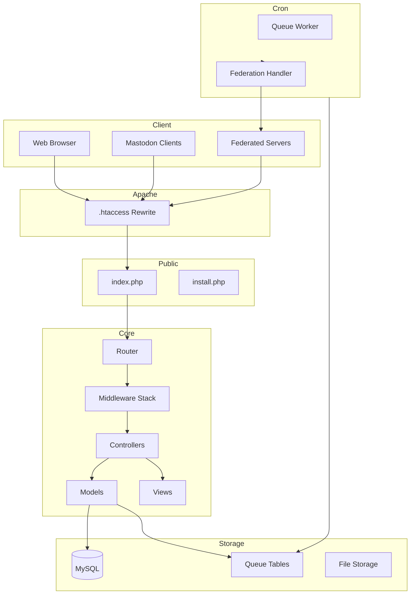

# NanoPub Architecture Documentation

A multi-user, federated social network compatible with Mastodon, optimized for shared hosting environments with severe memory constraints.

---

## Table of Contents

1. [Overview and Constraints](#1-overview-and-constraints)
2. [Directory Structure](#2-directory-structure)
3. [Micro-MVC Architecture Design](#3-micro-mvc-architecture-design)
4. [Request Flow Documentation](#4-request-flow-documentation)
5. [ActivityPub Federation Design](#5-activitypub-federation-design)
6. [Memory Optimization Strategies](#6-memory-optimization-strategies)
7. [Database Schema Overview](#7-database-schema-overview)
8. [Cron-based Processing](#8-cron-based-processing)

---

## 1. Overview and Constraints

### 1.1 Project Goals

NanoPub is designed to be a lightweight, federated social network server that:

- **Federates with Mastodon** via the ActivityPub protocol
- **Runs on shared hosting** with minimal resources
- **Supports multiple users** on a single instance
- **Maintains API compatibility** with Mastodon clients

### 1.2 Technical Constraints

| Constraint | Value | Impact |
|------------|-------|--------|
| PHP Version | 8.1+ | Strict typing, readonly properties, enums |
| Memory Limit | 128MB per process | No object caching, streaming processing |
| Web Server | Apache | .htaccess routing, no nginx config |
| Database | MySQL/MariaDB | Standard shared hosting DB |
| Processing | HTTP + Cron only | No daemons, no long-running processes |
| No Composer dependencies | Runtime | Vendor autoload consumes ~10-20MB |

### 1.3 Design Principles

1. **Memory-First Design**: Every decision considers the 128MB limit
2. **Stream Processing**: Never load full datasets into memory
3. **Database as Cache**: Use MySQL for state, avoid in-memory state
4. **Minimal Abstraction**: Direct PDO, no ORM overhead
5. **Lazy Loading**: Load resources only when needed
6. **Early Termination**: Free resources as soon as possible

### 1.4 Architecture Overview Diagram



---

## 2. Directory Structure

### 2.1 Complete Directory Tree

```
nanopub/
|-- public/                      # Web root (document root)
|   |-- index.php                # Single entry point for all requests
|   |-- install.php              # Installation wizard
|   |-- .htaccess                # Apache URL rewriting rules
|   |-- assets/                  # Static assets (CSS, JS, images)
|       |-- css/
|       |-- js/
|       |-- images/
|       |-- fonts/
|
|-- src/                         # Core application code
|   |-- Controllers/             # Request handlers
|   |   |-- Web/                 # Web UI controllers
|   |   |   |-- HomeController.php
|   |   |   |-- AuthController.php
|   |   |   |-- StatusController.php
|   |   |   |-- ProfileController.php
|   |   |   |-- SettingsController.php
|   |   |   |-- AdminController.php
|   |   |
|   |   |-- Api/                 # REST API controllers
|   |   |   |-- v1/              # Mastodon API v1 compatibility
|   |   |   |   |-- AccountsController.php
|   |   |   |   |-- StatusesController.php
|   |   |   |   |-- TimelinesController.php
|   |   |   |   |-- NotificationsController.php
|   |   |   |   |-- MediaController.php
|   |   |   |   |-- AuthController.php
|   |   |   |
|   |   |   |-- v2/              # Mastodon API v2 endpoints
|   |   |       |-- SearchController.php
|   |   |       |-- InstanceController.php
|   |   |
|   |   |-- ActivityPub/         # ActivityPub endpoints
|   |       |-- InboxController.php
|   |       |-- OutboxController.php
|   |       |-- ActorController.php
|   |       |-- WebfingerController.php
|   |       |-- HostMetaController.php
|   |
|   |-- Models/                  # Data access layer
|   |   |-- Account.php          # User accounts
|   |   |-- Status.php           # Posts/statuses
|   |   |-- MediaAttachment.php  # Media files
|   |   |-- Notification.php     # User notifications
|   |   |-- Follow.php           # Follow relationships
|   |   |-- FollowRequest.php    # Pending follow requests
|   |   |-- Like.php             # Favourites
|   |   |-- Bookmark.php         # Bookmarks
|   |   |-- Boost.php            # Reblogs/boosts
|   |   |-- Instance.php         # Instance configuration
|   |   |-- DomainBlock.php      # Blocked domains
|   |   |-- Report.php           # User reports
|   |   |-- Queue/               # Queue-related models
|   |       |-- ActivityQueue.php
|   |       |-- DeliveryQueue.php
|   |
|   |-- Views/                   # Templates (plain PHP, no engine)
|   |   |-- layouts/
|   |   |   |-- default.php      # Main layout
|   |   |   |-- bare.php         # Minimal layout for embeds
|   |   |
|   |   |-- partials/            # Reusable components
|   |   |   |-- header.php
|   |   |   |-- footer.php
|   |   |   |-- sidebar.php
|   |   |   |-- status.php       # Single status render
|   |   |   |-- account-card.php
|   |   |   |-- notification.php
|   |   |
|   |   |-- web/                 # Web UI views
|   |   |   |-- home/
|   |   |   |-- auth/
|   |   |   |-- statuses/
|   |   |   |-- profiles/
|   |   |   |-- settings/
|   |   |   |-- admin/
|   |   |
|   |   |-- error/               # Error pages
|   |       |-- 404.php
|   |       |-- 500.php
|   |
|   |-- Helpers/                 # Utility functions
|   |   |-- functions.php        # Global helper functions
|   |   |-- crypto.php           # Cryptographic utilities
|   |   |-- http.php             # HTTP utilities
|   |   |-- json.php             # JSON encoding/decoding
|   |   |-- time.php             # Time formatting
|   |   |-- text.php             # Text processing
|   |   |-- validation.php       # Input validation
|   |   |-- pagination.php       # Pagination helper
|   |
|   |-- Services/                # Business logic services
|   |   |-- AuthService.php      # Authentication logic
|   |   |-- ActivityPubService.php # Federation logic
|   |   |-- MediaService.php     # Media processing
|   |   |-- NotificationService.php
|   |   |-- SearchService.php    # Search functionality
|   |   |-- QueueService.php     # Queue management
|   |
|   |-- Middleware/              # Request middleware
|   |   |-- AuthMiddleware.php   # Authentication check
|   |   |-- RateLimitMiddleware.php
|   |   |-- CorsMiddleware.php   # CORS handling
|   |   |-- JsonMiddleware.php   # JSON parsing
|   |   |-- SignatureMiddleware.php # HTTP Signatures
|   |
|   |-- Core/                    # Framework core
|   |   |-- App.php              # Application container
|   |   |-- Router.php           # URL routing
|   |   |-- Request.php          # Request wrapper
|   |   |-- Response.php         # Response builder
|   |   |-- Database.php         # PDO wrapper
|   |   |-- Config.php           # Configuration loader
|   |   |-- Session.php          # Session management
|   |   |-- View.php             # View renderer
|   |
|   |-- Exceptions/              # Custom exceptions
|       |-- NotFoundException.php
|       |-- ValidationException.php
|       |-- AuthenticationException.php
|       |-- RateLimitException.php
|
|-- config/                      # Configuration files
|   |-- app.php                  # Application settings
|   |-- database.php             # Database connection
|   |-- instance.php             # Instance metadata
|   |-- routes.php               # Route definitions
|   |-- middleware.php           # Middleware pipeline config
|
|-- storage/                     # Writable storage
|   |-- uploads/                 # User uploaded files
|   |   |-- accounts/            # Account-specific files
|   |   |-- media/               # Media attachments
|   |   |-- cache/               # Temporary cache files
|   |
|   |-- queue/                   # Queue state files
|       |-- locks/               # Processing locks
|       |-- state/               # State tracking
|
|-- cron/                        # Cron job scripts
|   |-- queue-worker.php         # Process queued activities
|   |-- federation.php           # Handle federation tasks
|   |-- cleanup.php              # Cleanup old data
|   |-- metrics.php              # Update instance metrics
|
|-- .htaccess                    # Root redirect to public/
|-- composer.json                # Dependency definitions
|-- README.md                    # Project documentation
```

### 2.2 File Purpose Descriptions

#### Public Directory (Web Root)

| File | Purpose | Memory Notes |
|------|---------|--------------|
| `index.php` | Single entry point; bootstraps app, routes requests | Minimal bootstrap, no preloading |
| `install.php` | Installation wizard; creates DB tables, admin user | Standalone, no framework overhead |
| `.htaccess` | Apache mod_rewrite rules for clean URLs | N/A - server config |
| `assets/*` | Static files served directly by Apache | Zero PHP memory - bypassed |

#### Controllers

| File | Purpose | Memory Notes |
|------|---------|--------------|
| `Web/*Controller.php` | Handle web UI requests | One instance per request |
| `Api/v1/*Controller.php` | Mastodon API v1 compatibility | JSON responses, no view overhead |
| `Api/v2/*Controller.php` | Mastodon API v2 endpoints | Same as v1 |
| `ActivityPub/*Controller.php` | Federation endpoints | Stream JSON, no buffering |

#### Models

| File | Purpose | Memory Notes |
|------|---------|--------------|
| `Account.php` | User account CRUD | Use generators for lists |
| `Status.php` | Post/status management | Stream large result sets |
| `MediaAttachment.php` | Media file metadata | Lazy-load file data |
| `Queue/*.php` | Queue item management | Process one at a time |

#### Views

| File | Purpose | Memory Notes |
|------|---------|--------------|
| `layouts/*.php` | Page layout templates | Shared across requests |
| `partials/*.php` | Reusable UI components | Render in-place, no buffer |
| `web/*.php` | Page-specific templates | Minimal variable scope |

#### Helpers

| File | Purpose | Memory Notes |
|------|---------|--------------|
| `functions.php` | Global helper functions | Stateless functions |
| `crypto.php` | Signing, hashing, encryption | Use native functions |
| `http.php` | HTTP client utilities | Stream responses |
| `json.php` | JSON streaming utilities | Use `JsonStreamingParser` |

#### Services

| File | Purpose | Memory Notes |
|------|---------|--------------|
| `AuthService.php` | Authentication, sessions | Minimal session data |
| `ActivityPubService.php` | Federation protocol logic | Stream large activities |
| `MediaService.php` | Image processing, uploads | Process in chunks |
| `QueueService.php` | Background job management | Single-item processing |

#### Middleware

| File | Purpose | Memory Notes |
|------|---------|--------------|
| `AuthMiddleware.php` | Verify user authentication | Load minimal account data |
| `RateLimitMiddleware.php` | Prevent abuse | Use DB, not memory |
| `SignatureMiddleware.php` | Verify HTTP signatures | Verify without loading full key |

#### Core

| File | Purpose | Memory Notes |
|------|---------|--------------|
| `App.php` | Application container | Lazy service loading |
| `Router.php` | URL to controller mapping | Static route table |
| `Request.php` | HTTP request wrapper | Stream php://input |
| `Response.php` | HTTP response builder | Stream large responses |
| `Database.php` | PDO singleton wrapper | Unbuffered queries |
| `Config.php` | Load config files | Cache in static variable |
| `Session.php` | Session management | Store minimal data |
| `View.php` | Template rendering | No output buffering |

#### Cron Scripts

| File | Purpose | Memory Notes |
|------|---------|--------------|
| `queue-worker.php` | Process queued activities | One item per invocation |
| `federation.php` | Send/receive federation | Batch with limits |
| `cleanup.php` | Remove old data | Process in chunks |
| `metrics.php` | Update statistics | Aggregate in SQL |

---

## 2. Directory Structure

### 2.1 Complete Directory Tree

```
nanopub/
|-- public/                      # Web root (document root)
|   |-- index.php                # Single entry point for all requests
|   |-- install.php              # Installation wizard
|   |-- .htaccess                # Apache URL rewriting rules
|   |-- assets/                  # Static assets (CSS, JS, images)
|       |-- css/
|       |-- js/
|       |-- images/
|       |-- fonts/
|
|-- src/                         # Core application code
|   |-- Controllers/             # Request handlers
|   |   |-- Web/                 # Web UI controllers
|   |   |   |-- HomeController.php
|   |   |   |-- AuthController.php
|   |   |   |-- StatusController.php
|   |   |   |-- ProfileController.php
|   |   |   |-- SettingsController.php
|   |   |   |-- AdminController.php
|   |   |
|   |   |-- Api/                 # REST API controllers
|   |   |   |-- v1/              # Mastodon API v1 compatibility
|   |   |   |   |-- AccountsController.php
|   |   |   |   |-- StatusesController.php
|   |   |   |   |-- TimelinesController.php
|   |   |   |   |-- NotificationsController.php
|   |   |   |   |-- MediaController.php
|   |   |   |   |-- AuthController.php
|   |   |   |
|   |   |   |-- v2/              # Mastodon API v2 endpoints
|   |   |       |-- SearchController.php
|   |   |       |-- InstanceController.php
|   |   |
|   |   |-- ActivityPub/         # ActivityPub endpoints
|   |       |-- InboxController.php
|   |       |-- OutboxController.php
|   |       |-- ActorController.php
|   |       |-- WebfingerController.php
|   |       |-- HostMetaController.php
|   |
|   |-- Models/                  # Data access layer
|   |   |-- Account.php          # User accounts
|   |   |-- Status.php           # Posts/statuses
|   |   |-- MediaAttachment.php  # Media files
|   |   |-- Notification.php     # User notifications
|   |   |-- Follow.php           # Follow relationships
|   |   |-- FollowRequest.php    # Pending follow requests
|   |   |-- Like.php             # Favourites
|   |   |-- Bookmark.php         # Bookmarks
|   |   |-- Boost.php            # Reblogs/boosts
|   |   |-- Instance.php         # Instance configuration
|   |   |-- DomainBlock.php      # Blocked domains
|   |   |-- Report.php           # User reports
|   |   |-- Queue/               # Queue-related models
|   |       |-- ActivityQueue.php
|   |       |-- DeliveryQueue.php
|   |
|   |-- Views/                   # Templates (plain PHP, no engine)
|   |   |-- layouts/
|   |   |   |-- default.php      # Main layout
|   |   |   |-- bare.php         # Minimal layout for embeds
|   |   |
|   |   |-- partials/            # Reusable components
|   |   |   |-- header.php
|   |   |   |-- footer.php
|   |   |   |-- sidebar.php
|   |   |   |-- status.php       # Single status render
|   |   |   |-- account-card.php
|   |   |   |-- notification.php
|   |   |
|   |   |-- web/                 # Web UI views
|   |   |   |-- home/
|   |   |   |-- auth/
|   |   |   |-- statuses/
|   |   |   |-- profiles/
|   |   |   |-- settings/
|   |   |   |-- admin/
|   |   |
|   |   |-- error/               # Error pages
|   |       |-- 404.php
|   |       |-- 500.php
|   |
|   |-- Helpers/                 # Utility functions
|   |   |-- functions.php        # Global helper functions
|   |   |-- crypto.php           # Cryptographic utilities
|   |   |-- http.php             # HTTP utilities
|   |   |-- json.php             # JSON encoding/decoding
|   |   |-- time.php             # Time formatting
|   |   |-- text.php             # Text processing
|   |   |-- validation.php       # Input validation
|   |   |-- pagination.php       # Pagination helper
|   |
|   |-- Services/                # Business logic services
|   |   |-- AuthService.php      # Authentication logic
|   |   |-- ActivityPubService.php # Federation logic
|   |   |-- MediaService.php     # Media processing
|   |   |-- NotificationService.php
|   |   |-- SearchService.php    # Search functionality
|   |   |-- QueueService.php     # Queue management
|   |
|   |-- Middleware/              # Request middleware
|   |   |-- AuthMiddleware.php   # Authentication check
|   |   |-- RateLimitMiddleware.php
|   |   |-- CorsMiddleware.php   # CORS handling
|   |   |-- JsonMiddleware.php   # JSON parsing
|   |   |-- SignatureMiddleware.php # HTTP Signatures
|   |
|   |-- Core/                    # Framework core
|   |   |-- App.php              # Application container
|   |   |-- Router.php           # URL routing
|   |   |-- Request.php          # Request wrapper
    |   |-- Response.php         # Response builder
|   |   |-- Database.php         # PDO wrapper
|   |   |-- Config.php           # Configuration loader
|   |   |-- Session.php          # Session management
|   |   |-- View.php             # View renderer
|   |
|   |-- Exceptions/              # Custom exceptions
|       |-- NotFoundException.php
|       |-- ValidationException.php
|       |-- AuthenticationException.php
|       |-- RateLimitException.php
|
|-- config/                      # Configuration files
|   |-- app.php                  # Application settings
|   |-- database.php             # Database connection
|   |-- instance.php             # Instance metadata
|   |-- routes.php               # Route definitions
|   |-- middleware.php           # Middleware pipeline config
|
|-- storage/                     # Writable storage
|   |-- uploads/                 # User uploaded files
|   |   |-- accounts/            # Account-specific files
|   |   |-- media/               # Media attachments
|   |   |-- cache/               # Temporary cache files
|   |
|   |-- queue/                   # Queue state files
|       |-- locks/               # Processing locks
|       |-- state/               # State tracking
|
|-- cron/                        # Cron job scripts
|   |-- queue-worker.php         # Process queued activities
|   |-- federation.php           # Handle federation tasks
|   |-- cleanup.php              # Cleanup old data
|   |-- metrics.php              # Update instance metrics
|
|-- .htaccess                    # Root redirect to public/
|-- composer.json                # Dependency definitions
|-- README.md                    # Project documentation
```

### 2.2 File Purpose Descriptions

#### Public Directory (Web Root)

| File | Purpose | Memory Notes |
|------|---------|--------------|
| `index.php` | Single entry point; bootstraps app, routes requests | Minimal bootstrap, no preloading |
| `install.php` | Installation wizard; creates DB tables, admin user | Standalone, no framework overhead |
| `.htaccess` | Apache mod_rewrite rules for clean URLs | N/A - server config |
| `assets/*` | Static files served directly by Apache | Zero PHP memory - bypassed |

#### Controllers

| File | Purpose | Memory Notes |
|------|---------|--------------|
| `Web/*Controller.php` | Handle web UI requests | One instance per request |
| `Api/v1/*Controller.php` | Mastodon API v1 compatibility | JSON responses, no view overhead |
| `Api/v2/*Controller.php` | Mastodon API v2 endpoints | Same as v1 |
| `ActivityPub/*Controller.php` | Federation endpoints | Stream JSON, no buffering |

#### Models

| File | Purpose | Memory Notes |
|------|---------|--------------|
| `Account.php` | User account CRUD | Use generators for lists |
| `Status.php` | Post/status management | Stream large result sets |
| `MediaAttachment.php` | Media file metadata | Lazy-load file data |
| `Queue/*.php` | Queue item management | Process one at a time |

#### Views

| File | Purpose | Memory Notes |
|------|---------|--------------|
| `layouts/*.php` | Page layout templates | Shared across requests |
| `partials/*.php` | Reusable UI components | Render in-place, no buffer |
| `web/*.php` | Page-specific templates | Minimal variable scope |

#### Helpers

| File | Purpose | Memory Notes |
|------|---------|--------------|
| `functions.php` | Global helper functions | Stateless functions |
| `crypto.php` | Signing, hashing, encryption | Use native functions |
| `http.php` | HTTP client utilities | Stream responses |
| `json.php` | JSON streaming utilities | Use `JsonStreamingParser` |

#### Services

| File | Purpose | Memory Notes |
|------|---------|--------------|
| `AuthService.php` | Authentication, sessions | Minimal session data |
| `ActivityPubService.php` | Federation protocol logic | Stream large activities |
| `MediaService.php` | Image processing, uploads | Process in chunks |
| `QueueService.php` | Background job management | Single-item processing |

#### Middleware

| File | Purpose | Memory Notes |
|------|---------|--------------|
| `AuthMiddleware.php` | Verify user authentication | Load minimal account data |
| `RateLimitMiddleware.php` | Prevent abuse | Use DB, not memory |
| `SignatureMiddleware.php` | Verify HTTP signatures | Verify without loading full key |

#### Core

| File | Purpose | Memory Notes |
|------|---------|--------------|
| `App.php` | Application container | Lazy service loading |
| `Router.php` | URL to controller mapping | Static route table |
| `Request.php` | HTTP request wrapper | Stream php://input |
| `Response.php` | HTTP response builder | Stream large responses |
| `Database.php` | PDO singleton wrapper | Unbuffered queries |
| `Config.php` | Load config files | Cache in static variable |
| `Session.php` | Session management | Store minimal data |
| `View.php` | Template rendering | No output buffering |

#### Cron Scripts

| File | Purpose | Memory Notes |
|------|---------|--------------|
| `queue-worker.php` | Process queued activities | One item per invocation |
| `federation.php` | Send/receive federation | Batch with limits |
| `cleanup.php` | Remove old data | Process in chunks |
| `metrics.php` | Update statistics | Aggregate in SQL |
