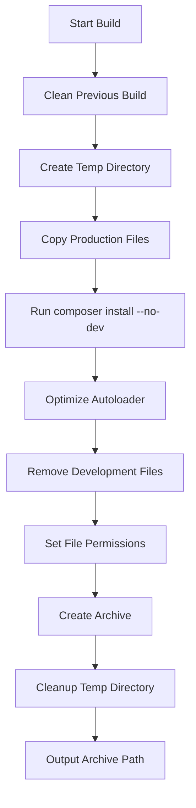

# Release Archive Design Document

## Overview

This document specifies the mechanism for creating production-ready release archives for NanoPub, a lightweight ActivityPub/federation server.

## Approach

### Recommended: Dual Approach

Implement **both** a shell script and a Composer command for flexibility:

1. **Shell Script** (`scripts/build-release.sh`) - Primary build tool for CI/CD and manual builds
2. **Composer Script** - Convenience wrapper that invokes the shell script

This approach provides:

- Shell script: Full control, CI/CD integration, no PHP dependency for build process
- Composer command: Developer-friendly interface for those already using Composer

---

## Files to Include

### Core Application Files

| Path | Description | Notes |
|------|-------------|-------|
| `public/` | Web root directory | All contents including index.php, assets, storage subdirs |
| `src/` | Application source code | Controllers, Core, Exceptions, Helpers, Middleware, Models, Services, Views |
| `config/` | Configuration files | app.php, database.php, instance.php, middleware.php, routes.php |
| `cron/` | Cron job scripts | cleanup.php, federation.php, metrics.php, queue-worker.php |
| `database/` | Database schema | schema.sql |
| `storage/` | Storage directories | With .gitkeep files and .htaccess |
| `composer.json` | Dependency definition | Required for autoloader |
| `composer.lock` | Locked dependencies | Ensures reproducible builds |
| `LICENSE` | License file | AGPL-3.0-or-later |

### .htaccess Files (Security Critical)

| Path | Purpose |
|------|---------|
| `.htaccess` | Root redirect to public/ |
| `public/.htaccess` | URL rewriting, security headers, file protection |
| `public/storage/.htaccess` | Denies web access to storage |
| `public/storage/config/.htaccess` | Denies web access to config |
| `public/storage/database/.htaccess` | Denies web access to database |
| `public/storage/queue/.htaccess` | Denies web access to queue |
| `public/storage/uploads/.htaccess` | Denies web access to uploads |
| `storage/.htaccess` | Denies web access to storage root |

### Storage Directory Structure

Include empty directories with `.gitkeep` files:

```
storage/
├── .htaccess
├── queue/
│   ├── locks/
│   │   └── .gitkeep
│   └── state/
│       └── .gitkeep
└── uploads/
    ├── accounts/
    │   └── .gitkeep
    ├── cache/
    │   └── .gitkeep
    └── media/
        └── .gitkeep

public/storage/
├── .htaccess
├── index.html
├── config/
│   └── .htaccess
├── database/
│   └── schema.sql
├── queue/
│   ├── .htaccess
│   ├── locks/
│   │   └── .gitkeep
│   └── state/
│       └── .gitkeep
└── uploads/
    ├── .htaccess
    ├── accounts/
    │   └── .gitkeep
    ├── cache/
    │   └── .gitkeep
    └── media/
        └── .gitkeep
```

---

## Files to Exclude

### Version Control

| Pattern | Reason |
|---------|--------|
| `.git/` | Version control metadata |
| `.gitmodules` | Submodule configuration |

### Development Tooling

| Pattern | Reason |
|---------|--------|
| `.kilocode/` | Development tooling directory |
| `tests/` | Test suite (not needed in production) |
| `phpunit.xml` | PHPUnit configuration |
| `phpunit.xml.dist` | PHPUnit distribution config |
| `.phpcs.xml` | PHP_CodeSniffer config |
| `.phpcs.xml.dist` | PHP_CodeSniffer distribution config |
| `phpstan.neon` | PHPStan configuration |
| `phpstan.neon.dist` | PHPStan distribution config |

### Documentation

| Pattern | Reason |
|---------|--------|
| `*.md` | Markdown documentation (README.md, ARCHITECTURE.md, agents.md) |
| `docs/` | Documentation directory (if exists) |

### IDE/Editor Files

| Pattern | Reason |
|---------|--------|
| `.idea/` | PhpStorm/IntelliJ |
| `.vscode/` | VS Code |
| `*.swp` | Vim swap files |
| `*.swo` | Vim swap files |
| `*~` | Backup files |
| `.DS_Store` | macOS metadata |
| `Thumbs.db` | Windows thumbnail cache |

### Build Artifacts

| Pattern | Reason |
|---------|--------|
| `release/` | Previous release builds |
| `*.tar.gz` | Previous archives |
| `*.zip` | Previous archives |

### Development Dependencies

The `vendor/` directory should NOT be included in the source archive. Instead, it will be generated during the build process with `composer install --no-dev --optimize-autoloader`.

---

## Pre-Processing Steps

### Build Process Flow



### Step Details

1. **Clean Previous Build**
   - Remove any existing `release/` directory
   - Remove any existing archive with same name

2. **Create Temporary Build Directory**
   - Create `release/nanopub-{version}/` structure
   - Use temporary directory for atomic operations

3. **Copy Production Files**
   - Copy all directories and files from include list
   - Preserve directory structure
   - Preserve file permissions

4. **Install Production Dependencies**

   ```bash
   composer install \
       --no-dev \
       --no-interaction \
       --optimize-autoloader \
       --no-progress \
       --working-dir=release/nanopub-{version}
   ```

5. **Remove Excluded Files**
   - Remove any `.md` files that were copied
   - Remove any IDE/editor files
   - Remove test files if present

6. **Set File Permissions**
   - Directories: 755
   - Files: 644
   - Storage directories: 755 (writable by web server)
   - `.htaccess` files: 644

7. **Create Archive**
   - Create `.tar.gz` archive
   - Optionally create `.zip` for Windows users

8. **Cleanup**
   - Remove temporary build directory
   - Leave only the archive file

---

## Archive Naming Convention

### Format

```
nanopub-{version}-{date}.{ext}
```

### Components

| Component | Format | Example |
|-----------|--------|---------|
| version | semver or git tag | `1.0.0`, `1.0.0-rc.1` |
| date | YYYYMMDD | `20260219` |
| ext | tar.gz or zip | `tar.gz`, `zip` |

### Examples

```
nanopub-1.0.0-20260219.tar.gz
nanopub-1.0.0-20260219.zip
nanopub-1.1.0-rc.1-20260315.tar.gz
```

### Version Detection

1. **Git Tag** (preferred): Use `git describe --tags --exact-match 2>/dev/null`
2. **Git Describe**: Use `git describe --tags` for development builds
3. **Fallback**: Use `dev` if not in a git repository

```bash
VERSION=$(git describe --tags --exact-match 2>/dev/null || git describe --tags 2>/dev/null || echo "dev")
DATE=$(date +%Y%m%d)
ARCHIVE_NAME="nanopub-${VERSION}-${DATE}"
```

---

## Post-Extraction Deployment Instructions

### Directory Structure After Extraction

```
nanopub-1.0.0-20260219/
├── .htaccess
├── LICENSE
├── composer.json
├── composer.lock
├── config/
│   ├── app.php
│   ├── database.php
│   ├── instance.php
│   ├── middleware.php
│   └── routes.php
├── cron/
│   ├── cleanup.php
│   ├── federation.php
│   ├── metrics.php
│   └── queue-worker.php
├── database/
│   └── schema.sql
├── public/
│   ├── .htaccess
│   ├── index.php
│   ├── install.php
│   ├── assets/
│   │   ├── css/
│   │   └── js/
│   └── storage/
│       └── ...
├── src/
│   └── ...
├── storage/
│   └── ...
└── vendor/
    └── ...
```

### Deployment Steps

1. **Extract Archive**

   ```bash
   tar -xzf nanopub-1.0.0-20260219.tar.gz
   ```

2. **Set Document Root**
   - Point web server document root to `public/` directory
   - Example for Apache: `DocumentRoot /var/www/nanopub/public`

3. **Set Permissions**

   ```bash
   # Set ownership (adjust user/group as needed)
   chown -R www-data:www-data nanopub-1.0.0-20260219/
   
   # Set directory permissions
   find nanopub-1.0.0-20260219/ -type d -exec chmod 755 {} \;
   
   # Set file permissions
   find nanopub-1.0.0-20260219/ -type f -exec chmod 644 {} \;
   
   # Make storage directories writable
   chmod -R 775 nanopub-1.0.0-20260219/storage/
   chmod -R 775 nanopub-1.0.0-20260219/public/storage/
   ```

4. **Configure Application**
   - Copy `config/database.php` and set database credentials
   - Or use the web-based installer at `/install.php`

5. **Initialize Database**
   - Import `database/schema.sql` or use the installer
   - The schema is also available at `public/storage/database/schema.sql`

6. **Setup Cron Jobs**

   ```bash
   # /etc/cron.d/nanopub
   
   # Queue worker (every minute)
   */1 * * * * www-data php /var/www/nanopub/cron/queue-worker.php
   
   # Cleanup (hourly)
   0 * * * * www-data php /var/www/nanopub/cron/cleanup.php
   
   # Federation tasks (every 5 minutes)
   */5 * * * * www-data php /var/www/nanopub/cron/federation.php
   
   # Metrics (daily at midnight)
   0 0 * * * www-data php /var/www/nanopub/cron/metrics.php
   ```

7. **Verify Installation**
   - Access the site in a browser
   - Check that the homepage loads
   - Verify `.htaccess` protection (try accessing `config/` - should return 403)

### Post-Install Security

After successful installation:

1. **Disable Installer** (uncomment in `public/.htaccess`):

   ```apache
   <Files "install.php">
       Order allow,deny
       Deny from all
   </Files>
   ```

2. **Remove Schema from Public** (optional):

   ```bash
   rm public/storage/database/schema.sql
   ```

---

## Implementation Specification

### Shell Script: `scripts/build-release.sh`

```bash
#!/usr/bin/env bash
# Description: Build a production-ready release archive for NanoPub
# Usage: ./scripts/build-release.sh [--zip] [--output=/path]

set -euo pipefail

# Configuration
PROJECT_ROOT="$(cd "$(dirname "${BASH_SOURCE[0]}")/.." && pwd)"
RELEASE_DIR="${PROJECT_ROOT}/release"
VERSION=""
DATE=$(date +%Y%m%d)
INCLUDE_ZIP=false
OUTPUT_DIR="${PROJECT_ROOT}"

# Parse arguments
while [[ $# -gt 0 ]]; do
    case "$1" in
        --zip) INCLUDE_ZIP=true; shift ;;
        --output=*) OUTPUT_DIR="${1#*=}"; shift ;;
        --help) echo "Usage: $0 [--zip] [--output=/path]"; exit 0 ;;
        *) echo "Unknown option: $1" >&2; exit 1 ;;
    esac
done

# Detect version
detect_version() {
    if git -C "$PROJECT_ROOT" describe --tags --exact-match &>/dev/null; then
        VERSION=$(git -C "$PROJECT_ROOT" describe --tags --exact-match)
    elif git -C "$PROJECT_ROOT" describe --tags &>/dev/null; then
        VERSION=$(git -C "$PROJECT_ROOT" describe --tags)
    else
        VERSION="dev"
    fi
}

# Build archive
build_release() {
    local ARCHIVE_NAME="nanopub-${VERSION}-${DATE}"
    local BUILD_DIR="${RELEASE_DIR}/${ARCHIVE_NAME}"
    
    echo "Building release: ${ARCHIVE_NAME}"
    
    # Clean previous build
    rm -rf "${RELEASE_DIR}"
    mkdir -p "${RELEASE_DIR}"
    
    # Copy production files
    # ... (implementation details)
    
    # Run composer install
    composer install --no-dev --optimize-autoloader --no-interaction --working-dir="$BUILD_DIR"
    
    # Create archives
    tar -czf "${OUTPUT_DIR}/${ARCHIVE_NAME}.tar.gz" -C "${RELEASE_DIR}" "$ARCHIVE_NAME"
    
    if [[ "$INCLUDE_ZIP" == true ]]; then
        zip -r "${OUTPUT_DIR}/${ARCHIVE_NAME}.zip" "${BUILD_DIR}"
    fi
    
    # Cleanup
    rm -rf "${RELEASE_DIR}"
    
    echo "Release created: ${OUTPUT_DIR}/${ARCHIVE_NAME}.tar.gz"
}

detect_version
build_release
```

### Composer Script Addition

Add to `composer.json`:

```json
{
    "scripts": {
        "release": "@php scripts/build-release.php",
        "release:zip": "@php scripts/build-release.php --zip"
    }
}
```

---

## Files to Create

| File | Purpose |
|------|---------|
| `scripts/build-release.sh` | Main build script (bash) |
| `scripts/build-release.php` | PHP wrapper for cross-platform support |
| `docs/release-archive-design.md` | This design document |

---

## Verification Checklist

After building a release archive, verify:

- [ ] Archive extracts to single directory with correct name
- [ ] All `.htaccess` files are present and correct
- [ ] `vendor/` directory exists with production dependencies
- [ ] No `.md` files present (except LICENSE if applicable)
- [ ] No `.git/` directory present
- [ ] No `.kilocode/` directory present
- [ ] Storage directories exist with `.gitkeep` files
- [ ] `composer.json` and `composer.lock` are present
- [ ] File permissions are correct after extraction

---

## Future Considerations

1. **GPG Signing**: Sign releases with GPG for supply chain security
2. **Checksums**: Generate SHA256 checksums alongside archives
3. **Release Notes**: Auto-generate release notes from git history
4. **Docker Image**: Build Docker image as part of release process
5. **GitHub Actions**: Automate releases via CI/CD pipeline
